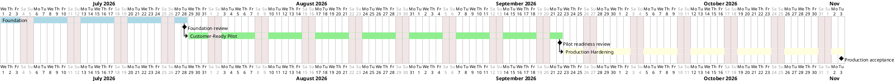

# Roadmap

<!--
Purpose:
Show the architecture roadmap and major transition sequence.

Use this page for:
- phases
- milestones
- architecture outcomes
- dependencies

Avoid:
- detailed backlog duplication
- daily delivery status
-->

| Phase | Goal | Exit Criteria | Dependencies |
| --- | --- | --- | --- |
| Foundation | Establish architecture repository, principles, requirements, and governance. | Artifact register, requirements, board model, and first decisions are reviewed. | Stakeholder availability |
| Customer-Ready Pilot | Close material gaps for a controlled pilot or first deployment profile. | Critical gaps are closed or waived; readiness evidence is linked. | Persistent stores, ingress/security, operations evidence |
| Production Hardening | Strengthen scale, resilience, compliance, and handoff evidence. | Restore drills, observability, operational runbooks, and conformance evidence are accepted. | Pilot lessons, platform decisions |

## Related Views

| View | Use When | Example |
| --- | --- | --- |
| Roadmap View | A reader needs to see architecture phases, timing assumptions, milestones, and readiness gates. | [Roadmap Gantt Chart](#example-roadmap-gantt-chart) |
| Transition State View | A reader needs to see how roadmap phases move the architecture between baseline, transition, and target states. | [Transition State Timeline](/architecture/architecture-states/transition-architectures?id=example-transition-state-timeline) |

## Example Roadmap Gantt Chart

